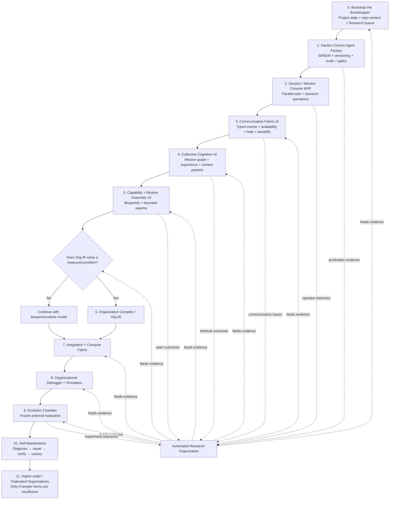

# Build Start-to-Finish — Mermaid

```mermaid
flowchart TD
    A[0. Bootstrap the Bootstrapper\nProject state + repo context + Research queue] --> B[1. Harden Current Agent Factory\nGREEN + versioning + evals + gates]
    B --> C[2. Session / Mission Console MVP\nParallel task + research operations]
    C --> D[3. Communication Fabric v0\nTyped events + availability + help + handoffs]
    D --> E[4. Collective Cognition v0\nMission graph + experience + context packets]
    E --> F[5. Capability + Mission Assembly v0\nBlueprints + bounded swarms]
    F --> G{Does Org-IR solve a measured problem?}
    G -- No --> H[Continue with blueprint/runtime model]
    G -- Yes --> I[6. Organization Compiler / Org-IR]
    H --> J[7. Integration + Compute Fabric]
    I --> J
    J --> K[8. Organizational Debugger + Simulation]
    K --> L[9. Evolution Chamber\nFrozen external evaluation]
    L --> M[10. Self-Maintenance\nDiagnose → repair → verify → canary]
    M --> N[11. Higher-order / Federated Organizations\nOnly if simpler forms are insufficient]

    R[Automated Research Organization] -. feeds evidence .-> A
    R -. feeds evidence .-> D
    R -. feeds evidence .-> E
    R -. feeds evidence .-> F
    R -. feeds evidence .-> G
    R -. feeds evidence .-> J
    R -. feeds evidence .-> K
    R -. feeds evidence .-> L

    B -. production evidence .-> R
    C -. operator telemetry .-> R
    D -. communication traces .-> R
    E -. retrieval outcomes .-> R
    F -. team outcomes .-> R
    L -. experiment outcomes .-> R
```

**Promotion rule:** each stage must make the next stage safer, more measurable, or faster. If it does not, do not build it.
