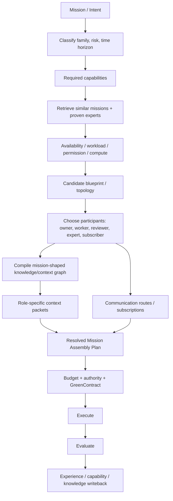

# Mission Assembly Flow

```mermaid
flowchart TD
    I[Mission / Intent] --> C[Classify family, risk, time horizon]
    C --> R[Required capabilities]
    R --> H[Retrieve similar missions + proven experts]
    H --> A[Availability / workload / permission / compute]
    A --> B[Candidate blueprint / topology]
    B --> P[Choose participants: owner, worker, reviewer, expert, subscriber]
    P --> K[Compile mission-shaped knowledge/context graph]
    K --> X[Role-specific context packets]
    P --> M[Communication routes / subscriptions]
    X --> L[Resolved Mission Assembly Plan]
    M --> L
    L --> G[Budget + authority + GreenContract]
    G --> E[Execute]
    E --> V[Evaluate]
    V --> W[Experience / capability / knowledge writeback]
```
