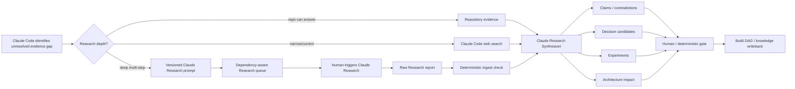

# Research Automation Flow — Claude Subscription Mode

Only the Research launch/return is manual in v0. Prompt construction, queueing, ingestion, synthesis, reconciliation and downstream project updates are automated.
