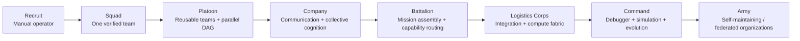

# Rising Through the Ranks

> **We do not appoint a five-star synthetic general on day one. We train one unit to win real missions, promote only what survives evaluation, and let each earned rank build the infrastructure required for the next. In this army, promotion is evidence-based.**
