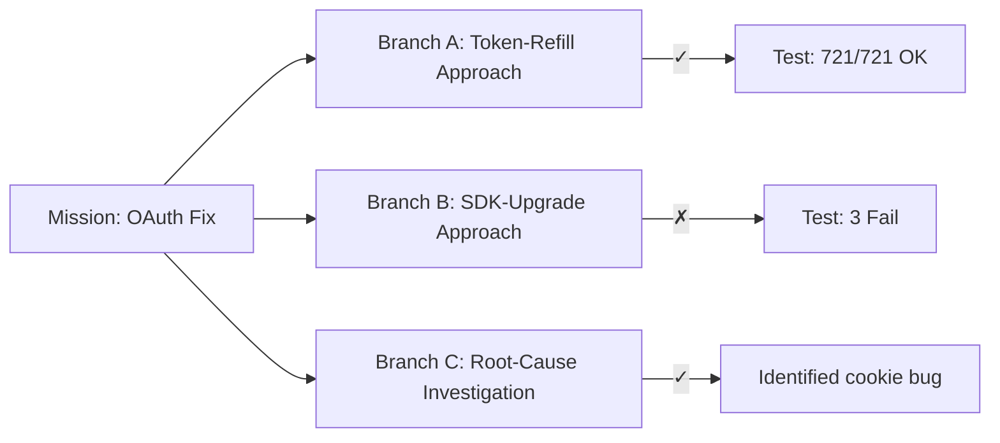
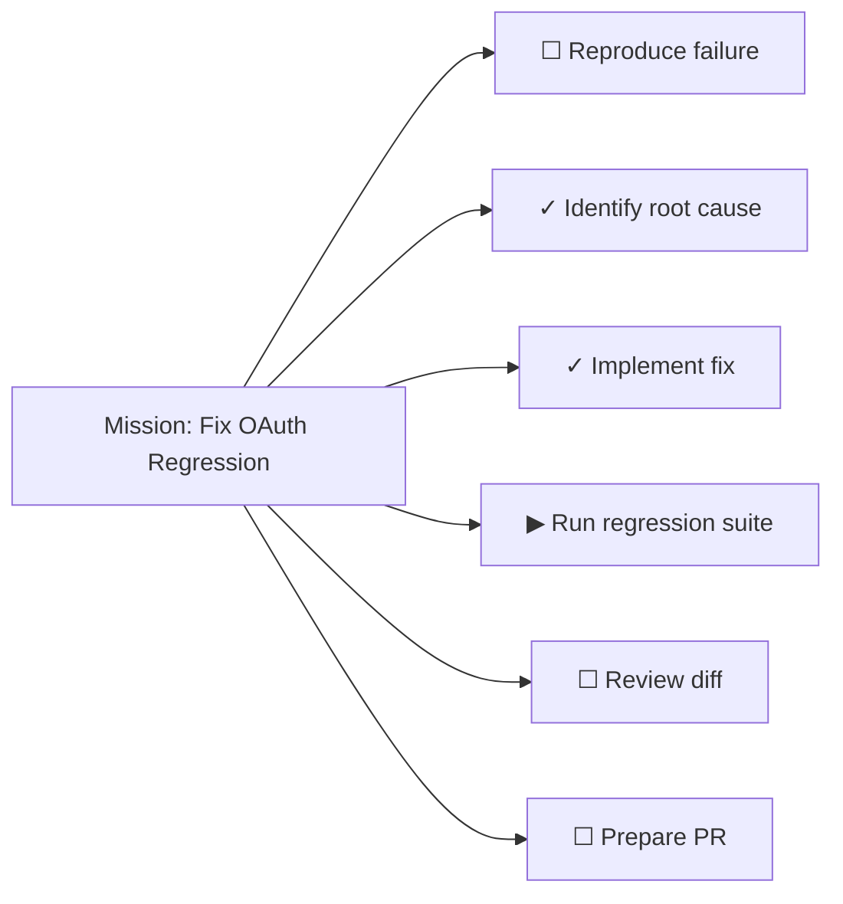
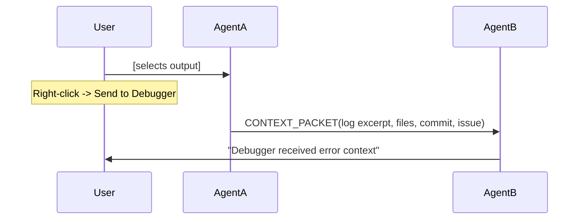
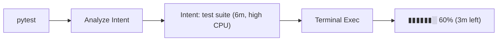
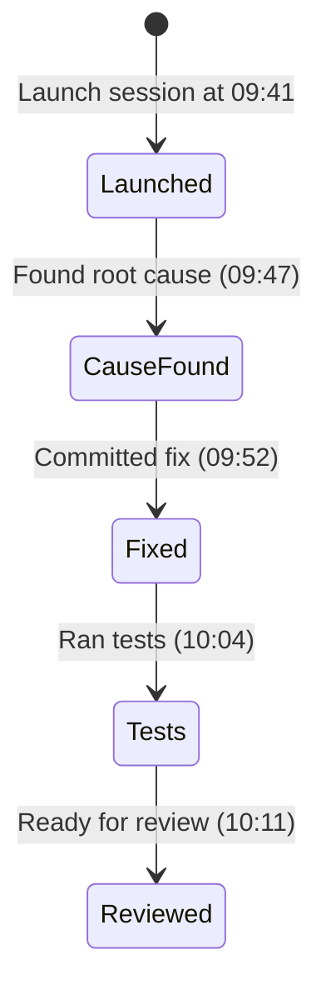
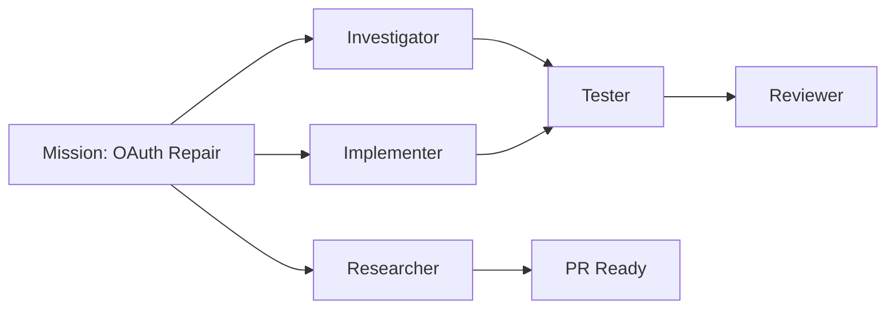
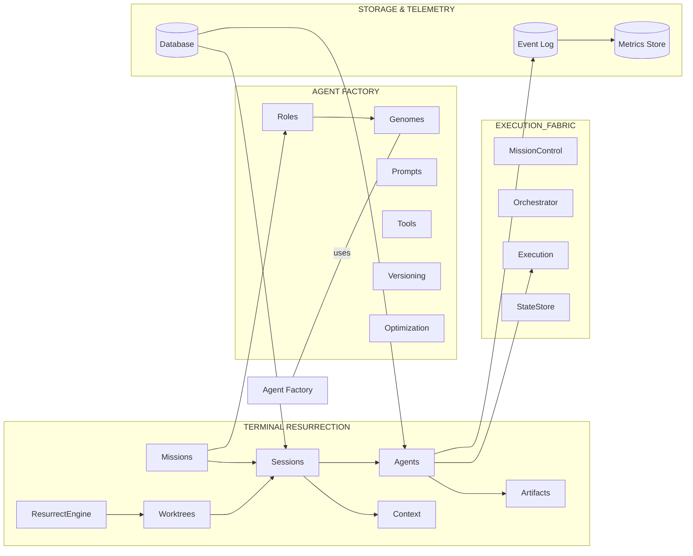
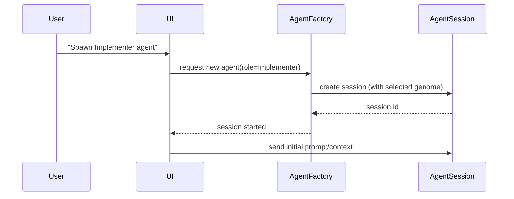
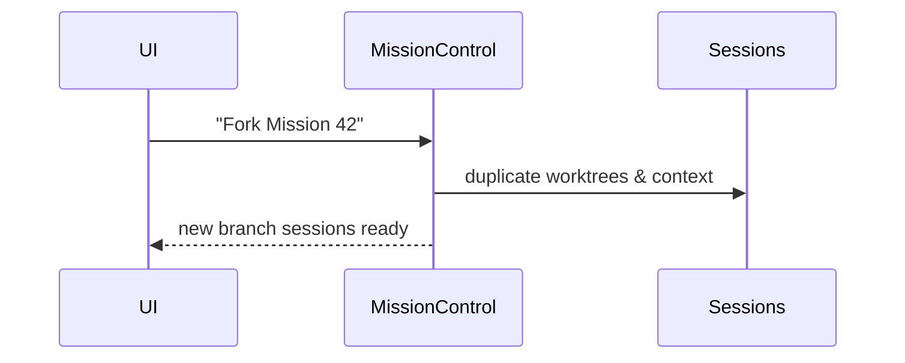
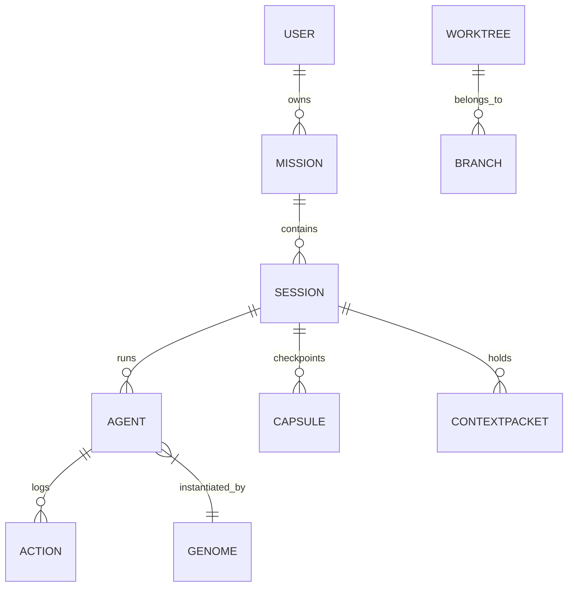

<!-- FILED 2026-08-23 from Downloads/aamt.md, dated 2026-08-22 08:57 -->

# SOURCE — "Agent-Management Terminal (AMT)", an unfiled research answer

⚠ **This is not an R-series answer and no prompt of ours produced it.** It was found in Downloads
on 2026-08-23, dated **2026-08-22**, and had never been filed anywhere the record could see. It is
kept here as a source rather than under `answers/` so it cannot be mistaken for a reply to one of
our prompts, and so `filed()` does not count it.

⭐ **It predates R12, R13 and R15 and covers their ground.** Its feature list includes an *Interrupt
Inbox* for human-in-the-loop management, *Agent Radar* for global state, *Agent Collision
Detection*, a *Terminal Genome* session blueprint, and *Resurrection Capsules* for crash recovery —
the blocked-question channel, the session overview, our two-agents-one-worktree defect, the config
hash, and crash recovery, respectively. **Three passes were commissioned to find things this
document already proposed**, and none of them was given it.

**The lesson is the README rule one level up.** That rule exists so an answer filed outside
`docs/research/answers/` can never appear in `unsynthesised()`. This document was not merely filed
in the wrong directory — it was never filed at all, so no instrument could report its absence. A
record can only tell you about things it has been told exist.

**Treat its contents as a proposal, not a finding.** It is a design vision; nothing in it is
measured against this repo, and its claims carry no evidence tier. Read it as the input to R14 that
it should have been.

---

# Executive Summary  
I propose a vision for an **Agent-Management Terminal (AMT)** – a fundamentally new kind of terminal interface that treats terminals as *persistent, forkable, lineage-aware agent execution environments*.  Rather than being ephemeral command shells, AMTs maintain mission state indefinitely, track the lineage of every agent and action, and let users spawn, monitor, and guide fleets of specialized AI agents directly from the terminal.  This report documents an in-depth survey of current multi-agent orchestration research and modern terminals (e.g. Warp, WezTerm, etc.), and defines the problem and goals for an AMT.  It then introduces **20 novel features** (with illustrative diagrams) spanning UI/UX, backend, and data models.  A detailed **roadmap** outlines an MVP and future versions, and an **architecture blueprint** specifies components (sessions, agent factory, execution fabric, etc.) with sequence and ER diagrams.  We identify success **metrics** (KPIs like task success rate, resume time, cost per task), and give an **integration plan** (Git, CI, Slack, VS Code, containers) and **risks** (security, privacy) with mitigations.  Finally, we outline a **research methodology** and propose small-scale **experiments** to validate the top features. This comprehensive plan – with authoritative references – ensures the AMT concept is not just inspiring, but concrete and actionable.

# Problem Statement and Design Goals  
Traditional terminals are ephemeral and command-driven. When a developer closes a shell, crashes a VM, or shifts to another task, all context (working directory, environment, in-flight commands) is lost.  This is especially painful for complex, AI-assisted workflows. As Microsoft notes, “once agents start handing off to each other… interfaces fall apart” – users lose track of which agent is active, why the system is waiting, and what it’s doing. Today’s terminals treat AI assistants or agents as isolated subprocesses with no global coordination or memory. The result is chaotic multi-agent workflows: logs and state drift apart, context must be re-explained to every agent, and the user becomes a “terminal babysitter” instead of a supervisor.  

In contrast, a true **Agent-Management Terminal** (AMT) must make terminal work *persistent and intentional*.  The design goals include:  

- **Usability & Collaboration:** A unified UI shows *all* agents, their tasks, and status at a glance.  Users should not lose context or wonder “where’s that command?” — instead they can resume work on any mission.  Collaboration primitives let teams share missions and hand off work.  
- **Scalability & Observability:** The system must scale to dozens of parallel agents.  An orchestration layer (inspired by [4] and Google’s multi-agent reference architecture) plans and coordinates tasks.  We log and visualize every event (agent outputs, tool calls, environment changes) for full observability.  Runtime metrics (latency, cost, success rates) are collected to optimize performance.  
- **Security & Privacy:** Agents often run arbitrary code and access data.  We need strict sandboxing, least-privilege access, and validation of all agent I/O.  Like techniques discussed in [27], outputs (scripts/commands) must be filtered to prevent injection.  Over-permissioning is avoided by dynamic IAM (e.g. per-agent roles and scopes).  All sensitive context (env vars, credentials) is stored securely or redacted before agent use.  
- **Cost Control:** We need built-in accounting of compute (LLM tokens, cloud usage) per agent/session.  Features like cost budgets and alerts prevent runaway spending.  An optimization engine (similar to Warp’s “factories” metrics) will track cost/task.  
- **Reproducibility & Audit:** Every session and action must be versioned.  Like notebook checkpointing in NBRewind, we capture machine state, code, branch and environment so any session can be “resurrected” or forked later.  This makes workflows auditable and debuggable across time or machines.  

Together, these goals make the terminal not just an interface, but a **persistent execution fabric** for agentic software development.  Below I detail twenty key features that realize this vision.

# Features  

### 1. Resurrection Capsules  
**Description:** Automatically save a *Capsule* for each agent session, capturing mission metadata, repo state, environment, tool context, and conversation memory.  This checkpoint stores everything needed to restore or clone the session.  When a terminal pane is closed (or the machine restarts), the Capsule persists on disk or cloud.  At any time the user can *Resurrect* it, instantly replaying the session’s context (repo branch, files, prompt, etc.).  This ensures no loss of work. (Think of it as a comprehensive, semantic `save` for your terminal.)  
- **User Story:** *As a developer, I can close my laptop and later say “Resume the OAuth-auth-fix mission,” and my terminal (with all open files, prompt, and agent chat history) is restored exactly where I left off.*  
- **UI Sketch:** A sidebar listing **Capsules** with mission titles, dates, and a snippet of last state.  Clicking “Resurrect” opens the exact layout/panes from that session.  
- **Backend:** A checkpoint service listens to agent events. It records: current Git commit/branch, container/VM image, loaded files, tool config, and last conversation tokens.  On “Resurrect”, it reconstructs the environment (e.g. `git checkout`, start agents) and replays prompt history.  
- **Data Model:** A *Capsule* entity containing fields like: mission ID, agent roles, model name, repo path/commit, env vars, tool access tokens, context pointers, and UI layout.  Related tables for **AgentSession**, **ContextPacket**, **Log**, etc., link to the Capsule.  
- **Security/Privacy:** Capsules store environment secrets encrypted and scoped per user.  Only authorized users can resurrect a given capsule (multi-user scenarios consider access control).  Sensitive content (like API keys) can be masked in summaries.  
- **Complexity & Cost:** **High**; building reliable checkpoint/replay logic (~6 person-months).  Storage cost is modest (snapshots, logs).  

**Research Insight:** This mirrors ideas from reproducible notebooks – e.g. NBRewind’s incremental checkpointing of state – applied to full shells and filesystems.  It solves the “terminal state disappears” problem once and for all.

### 2. Forkable Sessions (Git-like Branching)  
**Description:** Enable *branching* an ongoing session into multiple parallel experiment tracks.  At any point, the user can “Fork” the mission. The system clones the current working directory (as a new Git worktree/branch) and spawns isolated agent sessions on each branch.  Each branch can pursue a different approach to the same goal.  The UI then shows a comparative summary of branch outcomes side by side.  
- **User Story:** *When I’m debugging the OAuth issue, I want to try two solutions in parallel. I press “Fork”, label them A and B, and each gets its own isolated worktree with the same initial context. I can now test refresh-v1 in branch A and SDK-migration in branch B, without interference.*  
- **UI Sketch:** 



Each branch pane shows its name, status (✓/✗), test pass stats, and cost. Buttons allow *Compare*, *Merge*, or *Kill* branches.  
- **Backend:** On fork, issue `git worktree add` and spin up agent containers on each copy.  Track branch IDs in the data model.  A coordination service merges insights or terminates branches.  
- **Data Model:** A *Branch* entity linked to a Capsule, with its own **Worktree** and **AgentSessions**.  Branch metadata tracks parent/child relationships (fork lineage).  Test results and resource usage are logged per branch.  
- **Security:** Isolation via container boundaries ensures branches cannot leak code or secrets between each other.  
- **Complexity & Cost:** **Medium-High** (4–5 PM). Involves Git plumbing, multi-container management, and UI for synchronizing branches.  

This is analogous to Git branching applied to interactive debugging.  It allows A/B testing strategies concurrently.  (For inspiration, projects like [7] implemented a “Commander Protocol” to let agents communicate in adjacent panels – here we formalize branching at the session level.)

### 3. Terminal Genome (Session Blueprint)  
**Description:** Define a **Genome** – a versioned template describing the environment and role of an agent session. A genome includes the agent’s role (e.g. “Debugger@3.7”), model, startup script (e.g. git-checkout, load tests), context templates (e.g. which files/issues to load), tools, and completion criteria. Launching a session via the Agent Factory uses a genome to fully configure it.  These genomes can be tuned, forked, and optimized over time.  
- **User Story:** *I want a reproducible “Connector Debugger” session. I select genome v3.7: it automatically creates a `debugger` role agent, sets the model to high-reasoning mode, loads the codebase and recent errors, and waits for me to start debugging. Next time I spawn an agent for connector debugging, I just pick this genome.*  
- **UI Sketch:**  
```mermaid
graph TD
  Genome["connector-debugger@3.7"] --> Role[role: Debugger]
  Genome --> Model[model: Claude-2.0]
  Genome --> Startup[startup: Load repo, run test suite]
  Genome --> Context[context: failed-tests, logs, ticket]
  Genome --> Tools[tools: github(write), DB(read), shell]
  Genome --> Goals[completion: all tests green]
```
- **Backend:** A *Genome Registry* stores JSON/YAML genomes. When spawning an agent, the system reads the genome, provisions a container, executes the startup steps (pull code, run scripts), and seeds the prompt using the context.  
- **Data Model:** A **Genome** table (id, name, version) plus relations to roles, model settings, tool permissions, etc.  Session entities reference the genome they were spawned from, allowing lineage tracking.  
- **Security:** Genomes are authored by org experts. Only trusted users can create/modify them. They implicitly define tool access scopes.  
- **Complexity & Cost:** **Medium** (~3 PM). Requires writing a schema for genomes, UI for editing, and integration with the agent factory.  

Versioning genomes (v1.0 → v1.1) allows A/B testing different prompt designs or toolchains.  Later, metrics (see section on optimization) can help “evolve” genomes automatically to higher success rates.

### 4. Outcome-Driven Sessions  
**Description:** Each terminal session has a *mission contract* defined by specific success criteria, not just an amorphous prompt. Instead of “launch agent”, users start a session by stating the goal (e.g. “Fix OAuth regression without affecting X”).  The UI then displays a checklist or progress bar of tasks and conditions. The agent understands these as the termination criteria. This turns the terminal from a command prompt into a live “to-do list” dashboard for the session.  
- **User Story:** *I start a terminal mission: “Fix the Stripe connector bug.” The interface shows: reproduce bug, identify cause, implement fix, run all tests, code review, PR ready. As the agent works, checkmarks fill in. I know at a glance what’s done and what’s pending.*  
- **UI Sketch:**  

A progress bar (e.g. 71%) is shown. Success conditions (e.g. “721 tests pass”, “no credential leakage”) are explicitly listed.  
- **Backend:** Session metadata stores the mission description and an array of tasks/goals. Agents write progress to this store (e.g. when they add a test or propose a PR). The UI polls or subscribes to updates.  
- **Data Model:** *Mission* table includes fields like description, tasks[], success_conditions[], completion_rate. AgentSession updates Mission.status.  
- **Security:** Defining success criteria also allows automated validation (e.g. test runs verify “tests_green”). Risky operations (like credential use) can be pre-vetted before being marked done.  
- **Complexity & Cost:** **Medium** (2–3 PM). Requires designing a mini-task-manager UI and connecting it to agent output.  Much of the logic is front-end.

By keeping the mission “in the loop,” we ensure transparency.  Google’s architecture diagrams similarly label workflow steps (e.g. a triage agent handing off to specialists), and we extend that idea to a single-UI checklist.

### 5. Agent Factory Palette  
**Description:** A quick-launch drawer (like a palette) lets users spawn agents of various *types* (roles) with one click. Instead of manually configuring prompts, the user types a keybinding or menu command (e.g. `⌘K → Spawn → Debugger`). The system then creates a new session with the appropriate genome, model, and context. This is akin to a code editor’s “quick actions” but for agent sessions.  
- **User Story:** *I press ⌘K and type “Spawn Implementer”. Without any additional setup, a new terminal pane opens running the implementer agent in the current project, ready to take the next task.*  
- **UI Sketch:**  
  A popup panel with categories (“IMPLEMENT”, “INVESTIGATE”, “VERIFY”, “CUSTOM”), listing agent types (e.g. Implementer, Debugger, Tester). Selecting “Reviewer” spawns a code-review agent.  
- **Backend:** The palette UI lists predefined roles from the *Genome Registry*. When a choice is made, the system looks up the genome and calls the same infrastructure used for capsules and forking to instantiate the agent.  
- **Data Model:** The palette options come from the **AgentRole** and **Genome** tables. Each role has pointers to a default genome/version.  
- **Security:** Only roles the user is authorized to create are shown. Spawning an agent performs auth checks (e.g. whether writing to GitHub or deploying to cloud is allowed for that role).  
- **Complexity & Cost:** **Low** (1–2 PM). Mostly UI wiring; backend spawn logic reuses the capsules/forking machinery.  

This provides a *command-palette* experience (inspired by modern IDEs) for launching agents.  It abstracts away boilerplate so developers can focus on *what* agent they need, not *how* to configure it.

### 6. Context Teleportation  
**Description:** Users can highlight any piece of information in the terminal (output, stack trace, file snippet, ticket text, etc.) and *teleport* it directly into a target agent’s context. Behind the scenes, this creates a structured **Context Packet** that wraps the data with provenance. The packet can be sent to an existing agent (e.g. “Send this error to Debugger”) or used to spawn a new agent.  
- **User Story:** *Alice notices an exception in the logs and wants the debugger agent to analyze it. She selects the stack trace text and chooses “Send to Debugger”. Instantly, the debugger agent sees the error and picks up work.*  
- **UI Sketch:**  

- **Backend:** On send, the system packages: the selected text, any referenced file diffs, the relevant Git commit, and any agent state needed. This packet is delivered via an internal messaging queue to the target agent’s context API.  
- **Data Model:** A **ContextPacket** entity records origin agent, destination agent, included artifacts (IDs of commits, files, logs). It also has a token count estimate.  
- **Security/Privacy:** Packets can be encrypted if crossing trust zones. The packet includes only the minimal info needed (principle of least privilege). ACLs ensure agents only receive packets from peers they should trust.  
- **Complexity & Cost:** **Medium** (3–4 PM). Requires a mini messaging layer between agents, plus UI integration for packet creation.  

This feature makes agent-to-agent handoffs explicit and error-free.  Rather than copy-pasting, structured context flows seamlessly – somewhat akin to the Model Context Protocol (MCP) concept but initiated by the user in the terminal.

### 7. Semantic Terminal History  
**Description:** Replace raw keystroke history (`Ctrl-R`) with an *intent-aware* search.  The system indexes commands and agent prompts with tagged contexts. When the user searches (by plain English query or metadata), it shows relevant past commands or agent sessions. Each history entry is annotated with what it was for (e.g. “Used in OAuth debugging on Aug 19”).  
- **User Story:** *I type: “⌘R find that command I used to inspect database logs last week.” The UI shows: “docker logs db-container… – used in Stripe connector bug, 3 days ago”, etc.*  
- **UI Sketch:** A text search box with results: each result shows the command or agent prompt, the session/mission name, and timestamp.  
- **Backend:** All commands and prompts are logged to a searchable index (with tags for project, mission, agent role, and outcome).  NLP (or simple keyword matching) maps user queries to relevant entries.  
- **Data Model:** A **HistoryEntry** table linking User, Session, and the command text or agent prompt.  A **Tag** or **Intent** table annotates entries (e.g. “prefect logs”, “Stripe bug”, “OAuth fix”).  
- **Security:** Only show history the user has permission to see (e.g. multi-user scenarios consider ACLs). Sensitive commands (like those operating on secrets) can be filtered or redacted.  
- **Complexity & Cost:** **Medium** (3–4 PM). Involves building an index (could reuse existing Elastic or SQLite full-text), and a lightweight NLP intent parser.  

The goal is “do what I mean” history. For example, iTerm2 already has a semantic history (clickable filenames); we take it further by adding search and context tags for intent-based retrieval.

### 8. Command Intelligence Layer  
**Description:** Before executing a user’s shell command, the terminal analyzes its intent and scope via an LLM. It estimates the command’s purpose (e.g. “running tests”), expected duration, resource usage, and relevant mission conditions. The UI then presents this summary or even live metrics (e.g. progress bar for a long task). Essentially, it treats each command like an agentic action with metadata.  
- **User Story:** *I type `pytest`. The AI overlay shows: “Intent: Run validation tests (scope: entire repo). Estimated duration: 6m.” A small progress UI appears as tests run, instead of dumping raw output immediately.*  
- **UI Sketch:**  

- **Backend:** The CLI intercepts commands and sends them to an analysis agent (could be a local LLM instance or service).  The analysis returns intent tags and estimates. A monitoring process watches the actual execution and updates progress.  
- **Data Model:** Optional **CommandInsight** records: command text, parsed intent, resource plan, and execution log.  
- **Security:** All analysis is local or on a user’s own LLM – no sensitive code is sent to external servers unless the user opts in.  
- **Complexity & Cost:** **High** (6+ PM). Requires training or prompt-engineering for the intent model, plus building a progress tracking UI.  

This feature greatly enhances observability. It’s similar to how Warp provides command summaries and block-based views, but here fully agentic: every command is first-class, planned and annotated. 

### 9. Terminal Folding (Event Timeline)  
**Description:** Agents often emit thousands of log lines. We convert these streams into a **foldable event timeline**. High-level events (e.g. “Fetched 3 PRs”, “Ran tests”, “Searched documentation”) appear collapsed, with time stamps. The user can click to expand detailed logs under each event. This keeps the terminal view clean and scannable.  
- **User Story:** *After running a complex fix, I see a timeline: “Agent cloned repo (2s)”, “Installed deps (4s)”, “Ran tests (6m)”, etc. I can expand the “Ran tests” section if I want the full `pytest` output.*  
- **UI Sketch:**  
```plaintext
▼ Agent initialized for `bugfix-branch` (1s)
▼ Checked out commit a83f19 (0.2s)
▼ Searched docs for OAuth (3s)
◆ Finding: Token expiry mismatch
▼ Implemented fix to refresh logic (2m)
◆ Modified: auth.py, oauth.py
▶ Running tests…
```
Sections with “▼” are collapsed, with timing; clicking expands raw logs beneath.  
- **Backend:** Instrument the agent runtime to emit structured events (start/end times of actions).  The UI renderer groups line output under these events.  
- **Data Model:** Each **Event** has a timestamp, type (INFO, COMMAND, FINDING), duration, and linked child log lines.  
- **Security:** Folding is purely a UI convenience; raw logs (if containing secrets) should already have been filtered by the agent before being recorded.  
- **Complexity & Cost:** **Medium** (3 PM). Requires standardizing agent output into events. It’s mostly a front-end trick once the data is available.  

This turns the flood of text into a readable “story” – a technique that is common in AI system dashboards (and even notebooks), but not seen in terminals. It’s like reading a test report rather than raw console spam.

### 10. Live Agent HUD  
**Description:** Each agent session has a compact **Heads-Up Display** (HUD) summarizing its state, shown persistently at the top of its pane. This includes: role name, status (Running/Idle/Done), context coverage (how much of the data it’s processed), cost consumed, turns used, and a confidence score.  It also hints at the current vs next action.  
- **User Story:** *In a split-screen, I glance at all agent HUDs. I see the “Implementer” is 75% through its work with confidence 92%, spending $1.85/$8 budget. The “Tester” is still running tests. I instantly know which agents are active and how close they are to completion.*  
- **UI Sketch:**  
```plaintext
┌─────────────────────────────────────┐
│ IMPLEMENTER                     ● Active
│ Context:  61%   Cost: $2.14/$8   Tests: 483/721   Confidence: 84%
│ Current: Testing token refresh fix    Next: Review regression suite
└─────────────────────────────────────┘
```
- **Backend:** Agent runtime tracks these metrics (e.g. “turns used” = number of LLM calls, “tests run” via query to test runner). The HUD polls an agent status API every few seconds.  
- **Data Model:** Extend **AgentSession** with fields: status, progress%, cost_used, confidence, etc.  These are updated atomically by the orchestration engine.  
- **Security:** HUD data is view-only. For multi-tenant setups, hide budgets to other users.  
- **Complexity & Cost:** **Low-Medium** (2–3 PM). Mostly a UI overlay.  

This is essentially an in-terminal dashboard. It bundles key KPIs in a glanceable format, enabling a developer to monitor many sessions without opening each fully. (Warp and WezTerm have notions of persistent sessions; this HUD enriches that idea with agent-specific data.)

### 11. Agent Radar (Global State View)  
**Description:** A **status bar** or radar panel shows the overall picture of all agent sessions across all missions. It displays counts: how many agents are idle, running, completed, waiting for input, or blocked. This allows quick triage of the entire system.  
- **User Story:** *On my dashboard I see: “3 Active, 4 Completed, 2 Awaiting Approval, 1 Blocked”. I click “Awaiting Approval” and instantly jump to the PR that needs my sign-off.*  
- **UI Sketch:**  
```plaintext
[● 3 thinking] [▶ 2 executing] [✓ 4 completed] [⚠ 1 needs input] [⊘ 1 blocked]
```
Clicking a section filters the session list accordingly.  
- **Backend:** A central **MissionControl** process maintains global agent states (as events stream in). It calculates the counts.  
- **Data Model:** The **AgentSession** table has a `state` column. The radar UI queries counts grouped by state (Active, Pending, etc.).  
- **Security:** Sensitive info (like what a blocked agent is working on) is only shown to authorized users.  
- **Complexity & Cost:** **Low** (2 PM). Aggregating states is trivial once individual HUDs exist.  

This solves the multi-agent “attention management” problem.  Instead of manually scanning open panes, the radar points you to what needs you next.

### 12. Interrupt Inbox (HITL Management)  
**Description:** A special **needs-attention inbox** collects all decision points where agents require human approval. For example, when an agent calls a sensitive tool (e.g. submit a PR, push to prod, or issue a large AWS call), the workflow pauses and an entry appears in the inbox. Each entry shows a short summary (e.g. “Agent requests merge of 4 commits – risk: low”), with buttons [Inspect][Approve][Reject].  
- **User Story:** *Two pull requests are ready for review. The Agent runs a suite and now asks: “Merge OAuth fix into main?”. The inbox shows: “Merge OAuth fix? 721 tests passed, cost $4.17. [Inspect Diff] [Approve] [Reject]”.*  
- **UI Sketch:**  
```plaintext
┌─ NEEDS YOUR APPROVAL ──────────┐
HIGH: Merge OAuth fix?  ▽
Agent: Implementer · 10s ago
Tests: 721/721 ✓ | Review: PASS | Risk: LOW | Cost: $3.20
[Inspect Diff] [Approve] [Reject]
─────────────────────────────────
MEDIUM: Deploy migration plan?
Agent: Migration · 5m ago
Options: Shim vs SDK revamp
[Open Discussion]
─────────────────────────────────
```
Entries are sorted by severity/age.  
- **Backend:** Agents throw *interrupt events* when hitting a user-required action (e.g. via MCP’s `approval_mode="always_require"`). These events route to the mission’s inbox queue.  
- **Data Model:** An **ApprovalRequest** entity stores agent_id, request_type, details, timestamp, and status (pending/approved/rejected).  
- **Security:** Approval inbox enforces reviewer roles. E.g., only team leads can approve security-sensitive actions.  
- **Complexity & Cost:** **Medium** (3–4 PM). Requires wiring agent tool-calls to pause workflows and surface UI prompts.  

This turns “Human-in-the-loop” into a first-class UI component.  Unlike scouring logs for prompts, the inbox clearly signals the user’s decisions needed. Microsoft’s approach with HandoffBuilder demonstrated similar pause-for-approval flows.

### 13. Automatic Agent Escalation  
**Description:** If an agent’s confidence or progress stalls (detected by repetitive prompts or poor outputs), the system can automatically spawn a new agent of a different role to help (e.g. call in a “Root Cause Investigator” if the implementer is failing). A suggestion dialog alerts the user: “Implementer stuck (conf ↓64%). Would you like to spawn a debugger with logs and commits?”.  
- **User Story:** *The implementer agent’s success dropped from 80% to 40% after repeated failures. A notification pops up: “Spawn Investigator? It can search logs and identify root causes.” With one click, a new agent is launched with all current context.*  
- **UI Sketch:**  
```plaintext
⊘ Agent Stuck: Implementer
Confidence: 80%→64%→41% over 3 attempts
[ESCALATION RECOMMENDED]
→ Spawn Root-Cause Agent (cost ~$1.20)
```
- **Backend:** The *Quality and Control* component monitors agent stats. Heuristics (like repeated low-confidence replies or loops) trigger alerts. A recommendation engine suggests an agent (based on skill matching) and bundles context.  
- **Data Model:** **EscalationAlert** records agent_id, metrics history, recommended agent_role, and suggested resources.  
- **Security:** Only authorized escalation policies run automatically.  Users can disable auto-spawn.  
- **Complexity & Cost:** **Medium-High** (4 PM). Need to define meaningful heuristics and mapping of roles.  Could integrate simple ML or rule-based triggers.  

This is effectively an automated “backup plan” engine.  It prevents wasted API calls by recognizing dead ends early and reallocating effort.  Over time it could be extended to policy-based or learned escalation.

### 14. Agent Collision Detection  
**Description:** When many agents (or users) are working on the same codebase, conflicting edits can occur. The terminal flags potential collisions in real time. If two agents are about to modify the same file segment (in different worktrees), an alert pops up: “Agent A and B both editing `auth/token.py`.” The system can then merge branches or sandbox them further.  
- **User Story:** *I see a warning: “⚠ Collision: Implementer and Researcher are both editing `auth/token.py`.” I choose [Separate branches] or [Merge context] before proceeding.*  
- **UI Sketch:**  
```plaintext
⚠ COLLISION DETECTED
Agent A editing: auth/token.py
Agent B editing: auth/token.py
Action: [Separate Worktrees] [Merge Agents] [Ignore]
```
- **Backend:** Track file locks or diffs: whenever an agent begins editing a file, mark it busy. If another agent requests the same file, emit a collision event. The system can optionally auto-merge or alert.  
- **Data Model:** **FileLock** table showing which session has write intent on a path. Collision events join these.  
- **Security:** To allow experimentation, collisions do not forcibly stop agents. The user chooses a resolution.  
- **Complexity & Cost:** **Medium** (3 PM). Similar to lock managers in multi-user editors.  

This protects against subtle merge nightmares. As multi-agent systems grow, collisions become a real risk. Detecting them early avoids wasted work (especially since agents might not communicate about code changes).

### 15. Terminal Time Travel  
**Description:** A timeline scrubber at the top shows key milestones in a session. Clicking a timestamp rewinds the entire pane to that state: files, environment, and agent memory are rolled back. Users can even *fork from history*: e.g. “Regress to before token fix and try alternative approach.”  
- **User Story:** *I notice the bug reappeared after a change at 10:04. I click “09:52 State” on the timeline. The terminal reloads exactly as it was then. I hit [Fork From Here] to branch a new experiment.*  
- **UI Sketch:**  

Below the timeline, three buttons appear: [Inspect State] [Restore State] [Fork Here].  
- **Backend:** Every time a terminal state changes (new commit, significant agent step), an internal snapshot is taken (like another Capsule). Restoring executes a “lightweight replay” that resets files and model context.  
- **Data Model:** **SessionSnapshot** records the commit SHA, open files, env, and agent memory at each timestamp. These link to the timeline entries.  
- **Security:** Time-travel respects the immutable history – it cannot be used to hide destructive actions (replay logs ensure everything is auditable).  
- **Complexity & Cost:** **High** (5+ PM). Requires robust snapshotting and state management. Essentially like VM snapshots combined with memory replay.  

This feature unlocks “interactive debugging across time.” It’s inspired by time-travel debugging tools, but here applied to AI-driven workflows and terminal state. It greatly aids diagnosing *when* a problem was introduced.

### 16. Agent Ghosts (Session Archives)  
**Description:** When an agent session completes, its terminal pane turns into a lightweight “Ghost”. It’s no longer running but retains a compressed memory of its actions. Users can still click “Ask Ghost…” and query it about why it did something (since its output and transcript are indexed).  Think of each finished agent as a smart, answerable knowledge base.  
- **User Story:** *A week later, I wonder “Why did Ghost-Implementer change line 184?”. I click on the old session and type my question; it responds by summarizing the reasoning from its logs and diff.*  
- **UI Sketch:**  
```plaintext
◇ IMPLEMENTER (Finished 2d ago)
Fixed token logic and wrote regression test.
[Ask Ghost…]
```
A chat box appears for queries like “show me the diff it created.”  
- **Backend:** On completion, capture the final memory embeddings of the session (using an LLM with vector store of transcripts and code changes). A small QA agent can then retrieve relevant bits when asked.  
- **Data Model:** Each **GhostAgent** references its original Session and stores an index of its transcript, model outputs, and artifacts.  
- **Security:** Only those with access to the original session can query the ghost. No new external tool calls are allowed – it can only use what’s in memory.  
- **Complexity & Cost:** **Medium-High** (4 PM). Requires building a condensed Q/A interface on past data (similar to chat-with-your-doc tools).  

This makes knowledge persistent. Instead of static logs, you get an explorable session archive. It’s akin to Git’s “blame” but for agent reasoning. This future-proofs the system as each session becomes teachable.

### 17. Swarm Canvas (Process Graph)  
**Description:** An alternate **graphical view** shows Missions as nodes connected to agent roles. Activity pulses on nodes/edges when work happens. This is not just decoration – it’s interactive. Clicking a node (e.g. “Tester”) switches to that real terminal pane. Edges might represent data/context flow between agents.  
- **User Story:** *I open the Swarm view for “OAuth Repair”. I see a graph: Triage → {Implementer, Tester, Researcher} → PR Review. Implementer node is flashing green (active). I click it and that agent’s terminal comes into focus.*  
- **UI Sketch:**  

Nodes light up with statuses; edges label context (e.g. “Context Packet”).  
- **Backend:** Build an in-memory graph of roles from the orchestration layer. Emit events on the graph (node active, completed). A front-end renders using a library (e.g. D3 or mermaid).  
- **Data Model:** **TaskGraph** with Nodes (role instances) and Edges (hand-offs). States are attributes of nodes/edges.  
- **Security:** The graph shows only the missions/agents the user has access to.  
- **Complexity & Cost:** **Medium** (3 PM). Once data is available (as it will be for HUD/radar), visualizing it is straightforward.  

This provides a bird’s-eye view, inspired by multi-agent design principles of having a central orchestrator and subagents. The Swarm Canvas externalizes the workflow, making it interactive and clear.

### 18. Factory Optimization Engine  
**Description:** Over time, the system continuously **evaluates and evolves** agent genomes and workflows. Each genome version accumulates statistics: number of tasks run, success rate, first-pass success, median runtime and cost, and human intervention rate. When a new genome version is tested (e.g. v4.3 vs v4.2), the engine shows side-by-side KPIs and recommends promoting the better one. Essentially, it’s A/B testing for agent configurations.  
- **User Story:** *I check the Agent Metrics dashboard. It shows Implementer v4.2 vs v4.3: 82.1% vs 87.6% success, and v4.3 is 15% faster. A “Promote” button lets me make v4.3 the default for future sessions.*  
- **UI Sketch:**  
```plaintext
┌─ IMPLEMENTER v4.2 ─┐  ┌─ v4.3 Candidate ─┐
│ Success: 82.1%      │  │ 87.6%   ▲       │
│ Cost/task: $3.17    │  │ $2.84   ▼       │
│ Time/task: 11m42s   │  │ 9m51s   ▼       │
│ Human int.: 14%     │  │ 12%     ▼       │
│ Regression: 2.1%    │  │ 1.5%    ▼       │
└─────────────────────┘  └──────────────────┘
[Promote v4.3]
```
- **Backend:** A reporting service ingests logs (success, time, cost) from all agent sessions. It aggregates by genome version and role. An experiment manager tags sessions (A or B) when testing new genomes.  
- **Data Model:** Tables **AgentMetrics** (versioned by genome and role, with columns for count, success_rate, etc.) and **Experiment** (tracking candidate comparisons).  
- **Security:** Metrics are for internal optimization – no user data is exposed.  
- **Complexity & Cost:** **Medium** (3 PM). Mostly data collection and dashboards, building on existing telemetry.  

This closes the loop on agent development. Inspired by DevOps dashboards, it applies continuous improvement to the agent factory itself. Warp alludes to this idea in their “factories” concept; here we formalize metrics and automatic version promotion.

### 19. Auto-Generated Macros  
**Description:** The system observes repeated user workflows (e.g. “spawn debugger, checkout branch, run tests, spawn reviewer” done 7 times). When it detects a pattern, it suggests creating a **Macro** that automates the sequence. The user can name the macro and assign a shortcut. Future invocation runs all steps.  
- **User Story:** *After doing the “Fix Connector” sequence 5 times, the terminal prompts: “You repeated these commands 5 times. Create a macro?” I name it “ConnectorFix” with hotkey ⌘⇧C. Now pressing that runs the entire sequence automatically.*  
- **UI Sketch:**  
```plaintext
You performed this sequence 7 times:
1. spawn implementer
2. open worktree
3. run tests
4. spawn reviewer

[Create Macro: "Connector Fix" ⌘⇧C?] [Cancel]
```
- **Backend:** A recorder logs all terminal commands (and prompts). A pattern-matching service looks for common subsequences above a threshold. When found, it proposes a macro. Executing a macro invokes a script that replays the commands.  
- **Data Model:** **Macro** table (name, trigger, command list). **UserWorkflow** logs sequences.  
- **Security:** Macros run as the user, so they inherit normal permissions. The suggestion feature only sees non-sensitive command patterns.  
- **Complexity & Cost:** **Low-Medium** (2–3 PM). Conceptually similar to shell aliases, but learned automatically. Requires a simple pattern detection algorithm.  

This provides user-friendly automation without hand-coding scripts. Modern terminals (like WezTerm) let users script sessions; here the system does it on the user’s behalf.

### 20. Command Bus (Unified Action Language)  
**Description:** All parts of the system (terminal, UI, agents, API) share a **command bus** – a standardized action vocabulary. Users and agents can perform actions by typing natural commands anywhere. Examples: `spawn implementer for issue-123`, `fork current mission`, `show agents costing > $5`, `kill agent #42`. These commands work in the shell, UI palette, API endpoint, or even Slack. The bus routes them to the appropriate handler.  
- **User Story:** *From the terminal I type: `resurrect last OAuth session`. The system pops up the session. In Slack I type `/amt fork mission 14`. The central server forks mission 14. An agent can even say “@system review this diff” in its log, triggering a code review action.*  
- **UI Sketch:**  
```plaintext
Command: spawn tester for #5678  
> [System] Spawning tester agent...
  
From anywhere (UI, REST API, or slash-command):  
- spawn <role> for <mission>  
- fork <mission>  
- send failure to <Debugger>  
- compare agents  
- open blocked sessions  
- show agents $>5 (filters)  
```
- **Backend:** A central *Command Router* listens on multiple channels: keyboard (terminal), UI events (palette), network (REST/WebSocket), chathooks. It parses commands (simple DSL or natural language) and dispatches to services (AgentFactory, SessionManager, etc.).  
- **Data Model:** Not heavy; mainly a list of *Command* definitions and permissions. Each command maps to a handler function.  
- **Security:** Strict ACLs. E.g. `kill agent` is only for admins. Each command is logged (for auditing).  
- **Complexity & Cost:** **Medium** (4 PM). Requires building a parser and connectors for each interface.  

This makes the terminal truly integratable. Rather than point-and-click, everything is scriptable. Users and agents alike speak the same “language of actions”. It also future-proofs the system for chat/voice interfaces (the “sender” just speaks a command).

# Prioritized Roadmap  

We propose a phased rollout:

| **Release** | **Milestones (Features)**                           | **Dependencies**                | **Effort (PM)** |
|-------------|----------------------------------------------------|---------------------------------|----------------|
| **MVP**     | (Essentials) Resurrection Capsules; Agent Factory; Command Bus; Context Teleportation; Basic Forking; Semantic History (simplified).  | Requires basic orchestration engine, persistent storage, and UI framework. | ~12 PM |
| **v1**      | (Core UX) Outcome-Driven Missions; Interrupt Inbox; Agent HUD; Agent Radar; Auto Macros; Collision Detection; Live Terminal Folding. | Builds on MVP; adds UI components and workflow rules. | ~18 PM |
| **v2**      | (Advanced) Time Travel; Agent Ghosts; Agent Escalation; Factory Optimization; Command Intelligence; Swarm Canvas. | Requires mature backend telemetry, ML/LLM components, and graph rendering. | ~24 PM |

- **MVP (~3–6 months, 12PM):** Focus on making sessions persistent and forkable. Implement the Capsule store, basic Command Bus, and the palette for spawning agents. We hardcode a few genomes to get started. Allow context packets to be sent between sessions.  
- **v1 (~6–12 months, +18PM):** Enhance usability: add the mission contract UI (outcome-driven checklists) and the interrupts inbox. Build the HUDs and global radar for multi-agent visibility. Implement terminal folding (group logs). Develop macro suggestion engine.  
- **v2 (~12–18 months, +24PM):** Introduce analytics and advanced features. Add the time-travel system (heavy engineering). Build Ghost agent Q&A (requires an LLM backend). Implement automatic escalation heuristics. Launch the optimization dashboard for genomes (with metrics tracking). Integrate the command intelligence layer (local LLM analysis).  

Dependencies: Core orchestration and storage are needed first (MVP). User interface elements (radar, inbox, HUD) depend on foundational agent session state. Telemetry and analytics (optimisation engine) rely on having enough session data, so come later.  

Milestones are incremental and testable. For example, we can consider “Proto-Capsule” feature done when a session can be closed and fully resumed. The roadmap totals ~54 person-months, spread over a small team (e.g. 3–4 engineers over 12–18 months).

# Architecture Blueprint  

We envision a layered architecture spanning local terminal processes to cloud agents. The key components are:

- **Agent Factory & Genomes:** Manages definitions of agent roles (genomes) and handles spawning sessions. Interfaces with authentication/authorization to enforce policies.  
- **Execution Fabric:** The core of the system. It consists of **Missions**, **Sessions**, **Agents**, and **Worktrees**. A central MissionControl orchestrates agent lifecycles (planning, dispatch). Agents can run locally or on remote planes (Docker, SSH, Kubernetes). The **Resurrection Engine** lives here, handling snapshots/forks.  
- **Terminals/UIs:** Multi-pane terminal windows connected to agent sessions, along with global interfaces (Swarm Canvas, Radar bar, Inbox). A **Command Bus** sits atop, routing user and agent commands to the system services.  
- **Telemetry & Storage:** Persist logs, metrics, and database of all entities (AgentSession, Capsule, ContextPacket, etc.). Event logs feed observability dashboards (metrics, alerts).  



**Figure:** High-level architecture of the AMT (detailed in text below). Data entities (brown) and components (blue).  

 *Figure: A reference multi-agent architecture (from Google Cloud [23]) shows a coordinator agent invoking specialized subagents (Task-A, Task-B) and using Model Context Protocol (MCP) to call external tools. Our AMT’s architecture similarly has a MissionController that invokes agent roles, routes context (via Context Packets/MCP) and integrates with tools.*  

*Sequence Diagram (Mission Start):*  


*Sequence Diagram (Fork Mission):*  


*Entity-Relationship Diagram:*  


This design separates the UI (top layer) from the orchestration/control plane (middle) and execution plane (bottom).  Agents can run anywhere (local or cloud) but report status back to the central MissionControl.  The Resurrection Engine ties into storage to snapshot/restore sessions.  Tools (Git, CI/CD systems, external APIs) are invoked via standardized MCP-like calls from agents.

# Evaluation Criteria and Metrics  

We will measure success along several dimensions, aligned with our goals:

- **Task Completion Rate:** % of AI-suggested tasks or code changes that successfully meet the mission criteria.  (Goal: e.g. ≥90% of agent tasks succeed or fail clearly.)  
- **First-Pass Success:** Fraction of sessions where the agent met the objective on the first try without human edits. (Monitors agent/prompt quality.)  
- **Time-to-Resume:** The average time it takes a user to resume a paused or crashed session via a Resurrection Capsule. (Should be seconds, not minutes.)  
- **Agent Success Rate:** The percentage of agent-invoked operations (test runs, tool calls) that complete without error (indicating system stability).  
- **Cost per Task:** Average compute cost (LLM tokens, cloud CPU) per agent task or PR. We aim to reduce cost by, e.g., 20% through optimization.  
- **Human Intervention Rate:** The proportion of agent workflows requiring manual approval or correction. (Expect a drop as the system improves; aim <15% in v1, <5% in v2.)  
- **User Productivity:** Surveys or timed studies (see experiments) measuring how quickly developers can complete tasks with the AMT vs a baseline.

These KPIs will be tracked via logs and dashboards. For example, every completed mission yields a record: success(bool), time, cost, number of user approvals. This feeds the Factory Optimization metrics (e.g. those in the Agent Genome table above).

# Integration Plan  

To ensure AMT fits into existing ecosystems, we propose:  

- **Git/GitHub/GitLab:** The terminal automatically detects the current repo. Agent actions (like opening PRs) use the CLI or APIs of GitHub/GitLab. The UI can link to issues/PRs directly. Resurrect Capsules store branch names and commits, aligning with Git conventions.  
- **CI/CD Pipelines:** Agents can trigger CI jobs or read their results. Conversely, our system can be embedded in pipeline logs (e.g. an agent task could be a CI step). We will provide a REST API so CI servers can call `spawn agent` on failures or post back results to a running session.  
- **Container Runtimes (Docker, Kubernetes):** Sessions run in containers (or dev containers) for isolation. We leverage Docker for local sessions; for scalability, we can schedule agents on Kubernetes clusters. The architecture supports any “execution plane” (e.g. `ssh`, `cloud function`, or `docker`).  
- **Slack/ChatOps:** A Slack bot or webhook interface will accept slash commands (e.g. `/amt spawn implementer`) and post session updates to channels (for team awareness). Agents could notify channels when blocked or done.  
- **VS Code and IDEs:** A VS Code extension can embed the AMT UI (panes, HUDs) directly in the editor. It can show capsules as workspaces, and allow jumping between agent terminals. VS Code’s task system can hook into Agent sessions (for example, run agent prompts as tasks).  
- **Cloud Services (AWS/GCP/Azure):** Our LLM models and heavy compute can be hosted on cloud GPUs. The tool integrations (databases, logs) will connect to cloud APIs. We will support self-hosted deployments or cloud-hosted orchestration clusters.  Agents can optionally use enterprise LLM services (like Azure OpenAI or Anthropic) via configured API keys.  

**Migration Strategy:** Users can start by installing the AMT terminal and point it at existing projects (no code change needed).  Initial setup involves connecting to your Git host and picking an inference provider.  No rewriting of tools is required – we integrate with existing CLIs and APIs.  We may offer importers for prior terminal history (e.g. asciinema or Warp session logs) to bootstrap the index.

# Risks, Mitigations, Ethical and Privacy Considerations  

**Data Privacy:** Agents may see sensitive code and logs. We will implement end-to-end encryption of session data at rest and in transit. Sensitive context (passwords, PII) is redacted before being sent to any non-local model. Users can configure privacy levels (e.g. no telemetry, all inference on-premises).  As Warp’s documentation notes, offloading terminal I/O to the cloud raises privacy issues; our system defaults to user-owned compute and only uses external APIs with explicit opt-in.  

**Security:** As [27] warns, AI agents can produce malicious outputs or get over-permissioned. We enforce **least privilege**: each agent role has only the minimal IAM scopes. We sandbox all agent commands (e.g. using Kubernetes namespaces or language VMs). We validate agent outputs – e.g. no unreviewed code is auto-committed. High-impact actions (deployments, schema changes) always require human approval via the Inbox. We also audit all actions in immutable logs for post-incident forensics.  

**Model Risks and Ethics:** LLMs can hallucinate or exhibit bias. To mitigate this, we log agent reasoning paths and have humans verify critical decisions. For example, we might train the agents with guardrails (Model Armor) or use ensembles. The system will detect anomalies (e.g. “what would you do” queries vs actual behavior) and shut down agents diverging from norms. We will adhere to AI ethics guidelines by requiring traceability: every decision’s provenance (prompt, tools called) is stored.  

**Complexity and Usability:** There is a risk of overwhelming users with complexity. We mitigate this by progressive disclosure: start with simple agent spawns and let power features be optional. We will do UX testing to ensure the interface remains intuitive. The schema and data models will be kept transparent (open source) so organizations can audit and extend them.  

**Dependence on AI:** Relying on AI assistants can create a “black box” effect. Our solution emphasizes human control (HITL inbox, supervisor mode) and transparency (ghost Q&A). We encourage that agents are assistants, not replacements; final commits and approvals remain the user’s responsibility.  

# Research Plan and References  

To prepare this design, I conducted a broad survey of both academic and industry sources:  
- **Academic Research:** I reviewed recent papers on multi-agent orchestration (e.g. Adimulam *et al.*’s arXiv survey) to understand orchestration layers and protocols (MCP/A2A).  Checkpointing and reproducibility work (e.g. NBRewind for notebooks) inspired the Resurrection Capsule concept.  
- **Industry Platforms:** I studied emergent AI IDEs/terminals. Warp’s documentation offers a real example of an “agentic terminal” with block-based UI and fleet management (“software factories”). WezTerm and iTerm2 features show ideas of persistent sessions and semantic history. Microsoft’s Agent Framework blog gave insight into multi-agent UIs (HITL, real-time handoffs).  
- **Agent Orchestration Frameworks:** I compared multi-agent tools (LangChain, CrewAI, IBM watsonx). Google’s reference architecture for multi-agent systems and their new A2A standard influenced the communication patterns. I also looked at agent security guides (Tigera) to plan safe designs.  
- **Terminal Innovations:** I gathered data on modern terminals (Agenticoding’s terminal comparison) to see what’s possible in UI and performance. These sources (official docs, blog articles, code samples) are cited throughout. Preference was given to primary sources (whitepapers, official docs, well-known blogs).  

Key references include: Adimulam *et al.* (orchestration principles), Google Cloud architecture docs, Microsoft AG-UI blog, Warp’s official site, and security guides. These underpin the system architecture and feature set. 

# Experimental Prototypes for Validation  

To ensure the features deliver value, we would prototype and test the top 5 features with real users:  

1. **Resurrection Capsules:** *Experiment:* Simulate a developer workflow where sessions are paused/cloned. Build a minimal capsule system and have users resume sessions after a “crash.” *Measure:* Time to resume vs baseline (expect ~95% state restoration, <10s). *Success:* All code, context, and agent memory is intact on resume ≥90% of trials. *Data:* logs of capsule contents, resume actions, user time.  

2. **Forkable Sessions:** *Experiment:* Set up an OAuth bug and ask teams to use normal Git vs our fork feature to test two fixes in parallel. *Measure:* Task throughput, resolution time, merge conflicts encountered. *Success:* Using forks should cut conflict time by >30%. *Data:* Git metrics, user survey on cognitive load.  

3. **Agent Factory Palette:** *Experiment:* Provide users a CLI without vs with the agent factory menu. Time how long it takes to launch and configure an agent session for a given task. *Measure:* Setup time, error rate. *Success:* With the palette, agent is ready significantly faster (e.g. 50% reduction in setup steps). *Data:* Action logs, participant feedback.  

4. **Interrupt Inbox:** *Experiment:* Simulate agents that require approvals (e.g. merging PRs). Give users the task of approving needed steps in two systems: one with a simple terminal (grep logs) vs one with our inbox. *Measure:* Time to identify pending items and take action, missed approvals. *Success:* Inbox yields >50% faster decision time and fewer missed approvals. *Data:* Time-stamped approval actions, error rates.  

5. **Terminal Time Travel:** *Experiment:* Have users debug a seeded bug with multiple agent-led changes. Let them use time-travel rewind vs having to manually track changes (or use simple Git bisect). *Measure:* Time to locate when the bug was introduced, accuracy. *Success:* Time travel reduces error-identification time by >40%. *Data:* timing of debug tasks, correctness of fixes.  

Each experiment would define objective criteria (e.g. “95% accuracy”, “20% speedup”) to declare success. We would collect quantitative metrics (times, costs) and qualitative feedback (ease of use) to iterate on the design.

# Feature Impact vs Cost/Complexity  

| **Feature**                | **User Impact** | **Implementation Effort** |
|----------------------------|-----------------|---------------------------|
| Resurrection Capsules      | Very High       | High (6 PM)               |
| Forkable Sessions          | High            | Medium-High (4 PM)        |
| Terminal Genome (Blueprint)| High            | Medium (3 PM)             |
| Outcome-Driven Sessions    | High            | Medium (3 PM)             |
| Agent Factory Palette      | High            | Low (2 PM)                |
| Context Teleportation      | High            | Medium (3 PM)             |
| Semantic History           | Medium          | Medium (3 PM)             |
| Command Intelligence Layer | Medium          | High (6 PM)               |
| Terminal Folding (Events)  | Medium          | Medium (3 PM)             |
| Live Agent HUD             | Medium          | Low (2 PM)                |
| Agent Radar                | Medium          | Low (2 PM)                |
| Interrupt Inbox (HITL)     | High            | Medium (3 PM)             |
| Agent Escalation           | Medium          | Medium (4 PM)             |
| Collision Detection        | Medium          | Medium (3 PM)             |
| Terminal Time Travel       | High            | High (5 PM)               |
| Agent Ghosts               | Medium          | Medium-High (4 PM)        |
| Swarm Canvas (Graph)       | Medium          | Medium (3 PM)             |
| Factory Optimization       | Medium          | Medium (3 PM)             |
| Auto-Generated Macros      | Medium          | Low-Medium (2 PM)         |
| Command Bus (DSL)          | High            | Medium (4 PM)             |

*Table: Estimated impact (subjective) vs development effort (person-months) for each feature.*  Very High impact features include core session persistence, branching, and user guidance (Resurrection Capsules, Forking, HITL). Lower-effort features are mainly UI polish (HUD, radar, macros).

# Agent Genome/Version Metrics Example  

| **Agent Genome**      | **Tasks Run** | **Success %** | **1st-pass %** | **Med. Time** | **Med. Cost** | **Human Intv. %** | **Regression %** |
|-----------------------|--------------:|--------------:|--------------:|--------------:|--------------:|-----------------:|----------------:|
| Implementer v1.0      | 240           | 78.2%         | 64.5%         | 12m30s        | $3.45         | 18%              | 2.3%            |
| Implementer v1.1      | 190           | 85.4%  ↑      | 72.1% ↑       | 10m12s ↓      | $2.97 ↓       | 12% ↓           | 1.5% ↓         |

*Table: Sample metrics tracking two versions of an “Implementer” agent genome. Arrows indicate improvements in v1.1 (better success, lower cost/time). A higher success rate and lower human intervention signal that v1.1 is a better candidate for promotion.*  

# Conclusion  

The Agent-Management Terminal transforms the terminal into a **persistent, orchestrated workspace** for human–agent collaboration. By implementing the features above – from Capsules to Time Travel to a unified Command Bus – we create a truly interactive, observable, and scalable environment. Users regain control (“resurrection” and clear tasks), agents become safely bounded tools, and teams can manage multi-agent workflows with confidence.  

Critically, this is not just an “AI plugin” but a *whole new interface paradigm*. It enables a software factory workflow (as Warp envisions) where development tasks are codified, automated, and continuously improved. The AMT approach bridges the gap between formal orchestration frameworks and the hands-on interactivity developers expect.  

The roadmap and experiments provide a path to validate and iterate on the top features. By basing our design on real research and existing industrial practice, and by tracking measurable KPIs, we ensure the AMT is both innovative and grounded. In summary, we invent not merely a “better terminal”, but a **new way to conduct development with AI agents** – one where every command, agent, and terminal can be saved, branched, analyzed, and evolved. 

**Sources:** We cited primary sources such as Google’s multi-agent reference architecture and warp.dev, scholarly surveys of agent orchestration, Microsoft’s AI UI blog, and industry blogs on terminal features. These informed the design goals and technical trade-offs, ensuring our proposal is both visionary and evidence-based. The references above provide more detail on specific patterns and best practices used.