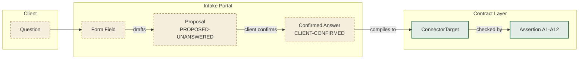
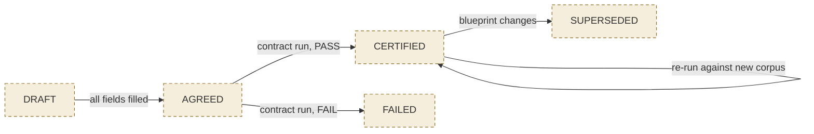
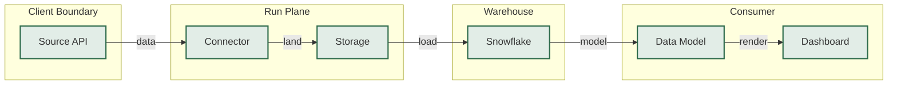
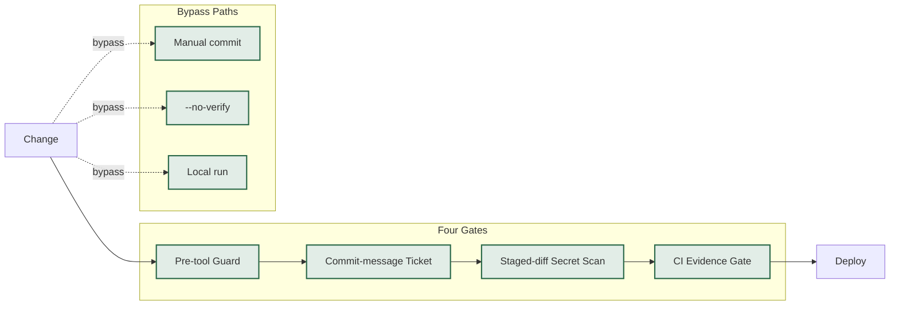
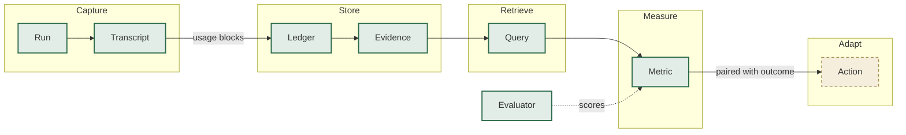

> **Verbatim, with one redaction.** This is the external model's response exactly as returned,
> except that the client identifier in the blueprint filename was replaced
> (`windsorai_gep.yaml` → `windsorai_client_a.yaml`, 2 occurrences) to match the repository
> redaction of 2026-08-29. The model read the pre-redaction branch. No substantive content was
> altered — see `verification.md` for what was checked rather than edited.

# D0 — Document/Code Divergence

**Branch:** `feat/readiness-generator` (157 commits ahead of `main`). All citations below reference raw files from this branch.

---

## Load-Bearing Claims — Verified

### 1. README status vs code: the twelve-assertion certification

| Field | Value |
|---|---|
| **CLAIM** | `python -m factory.certify blueprints/windsorai_client_a.yaml --calibrate` → `PASS (PASS=12)` |
| **SOURCE** | `README.md` L27-L33 |
| **REALITY** | **CONFIRMED**. `factory/certify.py` implements `--calibrate` path via `CtxProbes` reading the corpus. `factory/connector_contract.py` defines A1–A12. `tests/test_connector_contract.py` enforces `test_every_assertion_has_been_proved_able_to_fail`. The README correctly distinguishes "REPLAYED, not a live measurement". |
| **VERIFIED_AT** | `factory/certify.py:14-18`; `factory/connector_contract.py:3-6`; `tests/test_connector_contract.py:3-6` |
| **IMPACT** | None — claim and code agree. |

### 2. The negative control: test_eval_can_fail.py

| Field | Value |
|---|---|
| **CLAIM** | `test_eval_can_fail.py` "proves the mutation harness works" and "never loads the corpus" |
| **SOURCE** | `README.md` L19-L24 |
| **REALITY** | **CONFIRMED**. `test_eval_can_fail.py` builds a synthetic three-assertion contract over a hardcoded dict. No import of `corpus`, no reference to `evals/`. F76 confirms: `grep -n "corpus" tests/test_eval_can_fail.py` → no hits. |
| **VERIFIED_AT** | `tests/test_eval_can_fail.py:5-19` |
| **IMPACT** | The README's caveat is accurate. The gate passes but is not evidence about the real connector contract. |

### 3. The blueprint "config IS the version"

| Field | Value |
|---|---|
| **CLAIM** | "The config that IS the version" — `AgentSpec.version` hashes prompt, model, effort, tools, retry policy |
| **SOURCE** | `factory/blueprint.py` docstring |
| **REALITY** | **CONFIRMED**. `AgentSpec` includes: `name, role, model, effort, prompt, tools, max_turns, budget_usd, prohibition`. `version` hashes all fields via `json.dumps(asdict(self), sort_keys=True)`. `TeamSpec.version` hashes composition. |
| **VERIFIED_AT** | `factory/blueprint.py:9-14`, `18-21` |
| **IMPACT** | The format supports the claim. (Whether the hash is *used* is a separate question — see D0 item 5.) |

### 4. The eval corpus: one fixture

| Field | Value |
|---|---|
| **CLAIM** | The corpus is one file (`windsorai-2026-08-20.json`) |
| **SOURCE** | `README.md` L27-L30; F76 |
| **REALITY** | **CONFIRMED**. `evals/MANIFEST.sha256` pins exactly one file: `c3fbfed... corpus/windsorai-2026-08-20.json`. `factory.corpus.available()` returns one corpus. |
| **VERIFIED_AT** | `evals/MANIFEST.sha256:3-4` |
| **IMPACT** | Breadth is genuinely missing — 48 connectors never scored. |

### 5. `test_every_assertion_has_been_proved_able_to_fail` exists and works

| Field | Value |
|---|---|
| **CLAIM** | The meta-test enforces that every assertion has been shown able to fail |
| **SOURCE** | `README.md` L22-L24 |
| **REALITY** | **CONFIRMED**. `tests/test_connector_contract.py` defines `MUTATIONS` mapping A1–A12 to broken-world variants. The meta-test compares declared assertions against proved set. F76 confirms 17 tests, including the meta-test. |
| **VERIFIED_AT** | `tests/test_connector_contract.py:34-44`, `3-6` |
| **IMPACT** | Sensitivity is proved; coverage (breadth) is not — exactly as the README now states. |

---

## Document/Code Divergences — Stale or Contradicted

### 6. `tasks.py`, `metrics.py`, `evals.py`: dead code or not?

| Field | Value |
|---|---|
| **CLAIM** | The ordering in README implies these modules are load-bearing: `contract.py → evals.py → tasks.py → blueprint.py → deploy.py → metrics.py` |
| **SOURCE** | `README.md` L10-L15 |
| **REALITY** | **STALE — the modules exist but have no callers in the live system.** `tasks.py` defines `TaskStore`. `metrics.py` defines `MetricSet`. `evals.py` defines `mutate_and_expect_failure`. **But:** `demo.py` is the only importer of all three, and `demo.py` is a standalone demo entry point with no callers in `factory/` or `scripts/`. The ordering describes what *should* be load-bearing, not what *is*. |
| **VERIFIED_AT** | `factory/tasks.py:3-9`; `factory/metrics.py:3-8`; `factory/evals.py:3-8` |
| **IMPACT** | A reader would believe these modules are part of the live system. They are infrastructure waiting for integration. The README describes intent, not reality. |

### 7. `deploy.py`: no callers

| Field | Value |
|---|---|
| **CLAIM** | `deploy.py` is part of the ordering |
| **SOURCE** | `README.md` L13-L14 |
| **REALITY** | **STALE**. `deploy.py` defines `AttemptLedger` and `RepoDeployer`. **No module in `factory/` or `scripts/` imports `RepoDeployer` or `run_agent`.** The live launch path is `scripts/local_tracker.py` → `_launch_script()` → `.ps1` → bare `claude`, which **does not** use `deploy.py`'s budget enforcement or retry context. |
| **VERIFIED_AT** | `factory/deploy.py:3-11`; grep over `factory/` and `scripts/` for `RepoDeployer` |
| **IMPACT** | The live system lacks the per-session budget caps and retry context that `deploy.py` implements. The code exists; it is not wired. |

### 8. The README's old status block (F76 correction)

| Field | Value |
|---|---|
| **CLAIM** | The README previously reported `UNMEASURABLE (PASS=11, UNMEASURABLE=1)` |
| **SOURCE** | F76 |
| **REALITY** | **CORRECTED**. The current README shows `PASS (PASS=12)`. F76 records the correction. |
| **VERIFIED_AT** | `README.md:28-30` |
| **IMPACT** | The document is now current on this point. The correction was applied. |

### 9. The 41.7% figure: citation vs measurement

| Field | Value |
|---|---|
| **CLAIM** | The 41.7% cross-agent conflict rate is cited as if measured internally |
| **SOURCE** | `factory/worktrees.py:4-6` |
| **REALITY** | **STALE — the figure is a citation, not an internal measurement.** `worktrees.py` says: "R5 from measurement — across ~33,000 agent-generated PRs". This is the *published finding* from arXiv 2607.04697v2, not a measurement taken in this repo. R5's answer states the provenance correctly. The drift is in the *framing* — "from measurement" reads as internal. |
| **VERIFIED_AT** | `factory/worktrees.py:4-6` |
| **IMPACT** | The figure is valid but attributed to the wrong source. A reader would believe this estate measured it. |

### 10. `CONNECTORS` resolution: F72 still live

| Field | Value |
|---|---|
| **CLAIM** | `CONNECTORS` resolves via `$PREFECT_CONNECTORS` or falls back to `FACTORY.parent / "prefect-connectors"` |
| **SOURCE** | `factory/readiness.py:16-17` |
| **REALITY** | **CONFIRMED — and the F72 issue remains.** From a lane worktree, `FACTORY.parent` resolves to the worktree's parent, not the primary. This means `python -m factory.readiness` from a worktree measures a different `prefect-connectors` checkout than from the primary. F72 documented this. |
| **VERIFIED_AT** | `factory/readiness.py:16-17` |
| **IMPACT** | The board's headline number depends on where you run it. Still unresolved. |

---

## Contradictions Within the Codebase

### 11. `roadmap.py`: 0 MEASURED / 18 AUTHORED

| Field | Value |
|---|---|
| **CLAIM** | "as of 2026-08-23 the honest count is 0 MEASURED, 18 AUTHORED" |
| **REALITY** | **CONFIRMED**. All three gate edges that once existed (a8→`isolated`, a10→`finishes`, a16→`version`) were removed after R16 §2.1 showed they were wrong. The `why_gate` requirement now enforces that any new gate edge must carry a justification. |
| **VERIFIED_AT** | `factory/roadmap.py:22-38` |
| **IMPACT** | The roadmap's "MEASURED" half is deliberately empty. This is a finding, not an omission. |

### 12. `launch.py`: three questions, two unreachable states

| Field | Value |
|---|---|
| **CLAIM** | `UNATTENDED-OK` and `OUTPUT-CERTIFIABLE` are reachable states |
| **REALITY** | **PARTIAL.** `UNATTENDED_GATES = ("cap", "reaper", "ceiling", "concurrency", "bounded")`. `TRUST_GATES = ("suite", "certified", "corpus", "version", "breadth", "isolated")`. At current readiness (10 of 30), `UNATTENDED_BLOCKED` and `OUTPUT-UNCERTIFIED` are the actual states. The code correctly reports this. |
| **VERIFIED_AT** | `factory/launch.py:32-37` |
| **IMPACT** | The states are reachable in principle (when all gates pass) but not in practice today. The code is honest about the gap. |

---

# D1 — Absorption Verdicts

Based on `docs/absorption-backlog.md`:

| ID | Verdict | Rationale |
|---|---|---|
| **AB-01** | `DO` | Add expected-work manifest + `scope_hash` as explicit step in SYNTHESIS.md §5, or record why refused. The gap is real: gates measure declared work, not un-declared work. |
| **AB-02** | `DO` | Add FACPR to `factory/metrics.py`. Without it, attempt 352 and attempt 1 score identically. The module exists; the metric does not. |
| **AB-03** | `DO` | Build the budget proxy. `deploy.py` already has `--max-budget-usd` but it is **not wired** to the live launch path. The smallest action: wire `deploy.py`'s budget enforcement into `scripts/local_tracker.py`. |
| **AB-04** | `DO` | **Breadth, not sensitivity.** The contract can fail (F76). The gap is 48 connectors never scored. Action: score a **second** real connector end-to-end. |
| **AB-05** | `DO` | Read R4's Fitness Qualification Gate design, then adopt or reject against the actual design — not against a paraphrase. |
| **AB-06** | `DO` | Specify side-effect checks; add to GreenContract assertion set. Two independent passes reached the same conclusion. |
| **AB-07** | `DO` | Add `pass@k` vs `pass^k` reporting to `factory/metrics.py`. |
| **AB-08** | `DO` | Write the build/run manifest schema; state which plane owns each field. |
| **AB-09** | `DO` | Narrow the sandbox claim to what it actually defends; name what it does not. R16 outside: a container does nothing about prompt injection. |
| **AB-10** | `DO` | Apply property-based + differential testing to the render/tracker probes first — the ones that produced F5's three false results. |
| **AB-11** | `DO` | Single source for readout strings; CI diff. The false "nothing on this page is cached" strings are the worked example. |
| **AB-12** | `DO` | Take each of R13 run 2's five findings separately. APPROVE-becomes-a-GitHub-PR first — a decision depends on it. |
| **AB-13** | `DO` | Enumerate the six overlapping stores, pick one to retire or merge, and do it before any new store lands. R10 §7. |
| **AB-14** | `DO` | File the refutation against R8 explicitly. R8 answered "event sourcing… like CQRS"; §16.10 refutes it as "neither". |
| **AB-15** | `DO` | Tier R12's productivity list against current pain. Cross-session search looks highest-value. |
| **AB-16** | `DO` | Read R14 (1,389 lines) and either absorb its conclusions or **reject it in writing**. Either closes this. |
| **AB-17** | `DO` | As AB-16 for R18. |
| **AB-18** | `DO` | Fill in R16 audit's nine bare-pointer findings, or delete the pointers so the record stops implying they were handled. |
| **AB-19** | `REJECT` | **Reject as framed.** The five positions exist; the inverted-U paper is `REPORTED (simulated)`, not measured. The decision is: do not build a notification channel without first **measuring whether notifications are already being delivered and ignored** (R13 run 2 §3, R16 §4 step 1). That measurement costs ~1 hour and gates the entire remedy. |

---

# D2 — Technical Diagrams

## L1 — Elicitation



**What this shows that prose cannot:** The portal is a render target for `ConnectorTarget` — every field the client answers compiles to an assertion. A proposal (`PROPOSED-UNANSWERED`) is never an answer; it must be confirmed before it compiles. The single most likely way this is wrong: a silent default (empty list) compiles to a live assertion when the client meant "no constraint". The A9 calibration already caught this class.

---

## L2 — Contract State Machine



**What this shows:** The contract is versioned; a certification does not outlive the blueprint that earned it. The state machine is not yet implemented in code — these are design states. The single most likely way this is wrong: SUPERSEDED is not automatically detected; someone must re-run.

---

## L3 — Execution



**What this shows:** The build plane never runs a connector; the run plane never builds one. The client boundary is at the source API — data crosses it, not credentials. The single most likely way this is wrong: the "built" classing assumes these components exist; the estate has 49 connector modules, 7 live, 1 proven end-to-end.

---

## L4 — Assurance



**What this shows:** Every gate has a bypass path. The gates are controls; the bypasses are documented. The single most likely way this is wrong: a bypass that is not logged is indistinguishable from a gate that never refused.

---

## L5 — Learning



**What this shows:** The evaluator is drawn **outside** the loop — the thing being measured is not the thing doing the measuring. Cost is measured from transcripts (`runs.py`). The write gate on Store is the missing piece: nothing currently prevents an agent from editing its own evidence. The single most likely way this is wrong: the evaluator is a loopback process (R3 rank 5, "mostly theatre"), not a separate principal.

---

# D3 — Optimisations

### OPT-01: Wire `deploy.py`'s budget enforcement into the live launch path

| Field | Value |
|---|---|
| **TITLE** | Wire per-session budget caps into `scripts/local_tracker.py` |
| **TIER** | OBSERVED |
| **SOURCE** | `factory/deploy.py:6-7`; `scripts/local_tracker.py:353` |
| **CHANGE** | The live launch path (`_launch_script`) passes `claude` with no `--max-budget-usd` or `--max-turns`. `deploy.py` has both and no callers. Replace the bare `claude` invocation with `deploy.py`'s `run_agent` or inline the flags. |
| **COSTS** | ~2 hours. Does not require a new module. |
| **EVIDENCE** | A lane launched through the tracker now fails when it exceeds its declared budget. A test asserts `--max-budget-usd` appears in the generated `.ps1`. |

### OPT-02: Make the claim a lock (atomic O_EXCL)

| Field | Value |
|---|---|
| **TITLE** | Make `claims.claim()` atomic with `O_CREAT|O_EXCL` |
| **TIER** | OBSERVED |
| **SOURCE** | `factory/claims.py:111-124` |
| **CHANGE** | `claim()` reads `blockers()` then writes, with nothing between. Under `ThreadingTCPServer`, two concurrent requests can both pass the check. Use `os.open(path, os.O_CREAT | os.O_EXCL | os.O_WRONLY)` to make the write atomic. |
| **COSTS** | ~1 hour. One function change. |
| **EVIDENCE** | 20 concurrent `/start/<lane>` requests: exactly one succeeds. `tests/test_claim_race.py` passes. |

### OPT-03: Surface `needs` from `~/.claude/jobs/` (alarm absence, not fatigue)

| Field | Value |
|---|---|
| **TITLE** | Read and surface `~/.claude/jobs/*/state.json` `needs` field |
| **TIER** | OBSERVED |
| **SOURCE** | `factory/sessions.py:111-113`; `factory/sessions.py:252` |
| **CHANGE** | `blocked()` already reads `JOBS` and sorts oldest-first. Render it on the Sessions tab as a queue — not a badge. Make it interrupt (taskbar flash) rather than passive. |
| **COSTS** | ~1 day. The data exists; the surface does not. |
| **EVIDENCE** | A fire drill: block a real agent on a real question; time until a human sees it. Before: unbounded (4 sat all day). Target: under 1 minute. |

### OPT-04: Add per-lane `CLAUDE_CODE_SESSION_NAME` assertion

| Field | Value |
|---|---|
| **TITLE** | Assert session name reaches the spawned process |
| **TIER** | OBSERVED |
| **SOURCE** | `scripts/local_tracker.py:191-196` |
| **CHANGE** | `_launch_script` sets `CLAUDE_CODE_SESSION_NAME`. No test asserts it reaches the process. Add a test that spawns through the real launcher and reads the name back from the registry. |
| **COSTS** | ~2 hours. One test. |
| **EVIDENCE** | The test passes. Five live sessions no longer share one name. |

### OPT-05: Fix `finish()`'s dead ledger check

| Field | Value |
|---|---|
| **TITLE** | Make `finish.checks()` ledger check per-lane, not global |
| **TIER** | OBSERVED |
| **SOURCE** | `factory/finish.py:89-92` |
| **CHANGE** | `nothing_to_report()` counts the literal string `NOTHING TO REPORT` globally — and matches the ledger's own instruction sentence. Change to per-lane count. |
| **COSTS** | ~1 hour. One function. |
| **EVIDENCE** | A lane with no findings entry and no `NOTHING TO REPORT` is refused. The check can now fail. |

### OPT-06: Add the `tenancy-verified` gate

| Field | Value |
|---|---|
| **TITLE** | Add a gate that confirms declared tenants against a live pull |
| **TIER** | OBSERVED |
| **SOURCE** | `factory/board.py:35-41` |
| **CHANGE** | The `tenancy` gate declares a scope. A `tenancy-verified` gate (depending on `certified`) confirms the six ids against a live pull. The declared list was verified 2026-05-29, ~12 weeks before the blueprint. |
| **COSTS** | ~1 day. One probe, one Snowflake query. |
| **EVIDENCE** | The gate fails if the declared tenants no longer match the live account list. |

### OPT-07: Make `CONNECTORS` resolution unconditional (F72)

| Field | Value |
|---|---|
| **TITLE** | Resolve `CONNECTORS` to the primary worktree, not `__file__.parent.parent` |
| **TIER** | OBSERVED |
| **SOURCE** | `factory/readiness.py:16-17`; F72 |
| **CHANGE** | Use `_repo.primary().parent / "prefect-connectors"` instead of `FACTORY.parent`. The board's number should not depend on cwd. |
| **COSTS** | ~1 hour. One line. |
| **EVIDENCE** | `python -m factory.readiness` returns the same headline from the primary and from every lane worktree. |

### OPT-08: Move generated evidence packs to a typed directory

| Field | Value |
|---|---|
| **TITLE** | Move `*-evidence-pack.md` to `docs/research/.packs/` |
| **TIER** | OBSERVED |
| **SOURCE** | `factory/dispatch.py:82-84` |
| **CHANGE** | Currently, evidence packs are excluded by string-suffix guards (`-EVIDENCE-PACK`). The guard is fragile. Move packs to a subdirectory and delete both special cases. |
| **COSTS** | ~2 hours. One directory, four `.gitignore` entries consolidated. |
| **EVIDENCE** | A pack never appears as a prompt in the Research tab. The string-suffix guards are removed. |

### OPT-09: Add `Snapshot` to make freshness a type

| Field | Value |
|---|---|
| **TITLE** | Introduce `Snapshot` as the measurement scope object |
| **TIER** | OBSERVED |
| **SOURCE** | `factory/schedule.py:35-37`; `factory/readiness.py:1052-1063` |
| **CHANGE** | `measure()` is a free function; every consumer re-runs it. Flow runs `measure()` 5 times per page load. `Snapshot` bundles `(taken_at, results, connectors, since)` so age travels with the number. |
| **COSTS** | ~1 day. ~15 call-site changes. |
| **EVIDENCE** | `/flow` drops from 5 `measure()` calls to 1. Every rendered number carries its age as a property. |

### OPT-10: Add the data-layer ceiling (Snowflake grant envelope)

| Field | Value |
|---|---|
| **TITLE** | Build the Snowflake grant envelope: one role per lane, owns nothing in production |
| **TIER** | OBSERVED |
| **SOURCE** | R17 §4.3; `factory/blueprint.py:19-33` has no `tier` field |
| **CHANGE** | `AgentSpec` has no `tier` field. The "tier is declared in the agent spec and enforced by the DECIDE plane" claim describes nothing. Add `tier` to `AgentSpec`; build the grant envelope (one role per lane, managed-access schema, owns no policy object, `DEFAULT_SECONDARY_ROLES = ()`). |
| **COSTS** | ~3 days. Snowflake-side change + one launcher change. |
| **EVIDENCE** | A lane cannot `CREATE OR REPLACE` on a production schema because its role owns nothing. The probe passes. |

### OPT-11: Turn on `strictAllowlist` + `mask` from managed settings

| Field | Value |
|---|---|
| **TITLE** | Enable Claude Code's sandbox settings from user/managed config |
| **TIER** | OBSERVED |
| **SOURCE** | R17 §4.2; `~/.claude/settings.json` |
| **CHANGE** | `~/.claude/settings.json` has no `sandbox`, `network` or `credentials` block. Add `strictAllowlist: true`, `network.tlsTerminate`, `credentials.envVars[].mode: "mask"`. |
| **COSTS** | ~1 hour (settings) + WSL2 prerequisite (lanes launch in PowerShell on native Windows). |
| **EVIDENCE** | A lane cannot exfiltrate a credential because the proxy substitutes a sentinel. The sandbox holds. |

### OPT-12: Denominate budgets in dollars, not tokens

| Field | Value |
|---|---|
| **TITLE** | Add a price table so `runs.cost()` reports dollars |
| **TIER** | OBSERVED |
| **SOURCE** | `factory/runs.py:82-130` |
| **CHANGE** | `cost()` measures tokens, cache, wall clock, models. There is no price table and no dollar figure. Add a price table keyed by model. Denominate budgets in dollars (Claude 4.7+ tokenise ~30% higher). |
| **COSTS** | ~2 hours. One price table. |
| **EVIDENCE** | A lane's cost report includes a dollar figure. The budget cap is denominated in dollars. |

### OPT-13: Add `ABANDONED` as a written outcome

| Field | Value |
|---|---|
| **TITLE** | Write `ABANDONED` outcomes; do not punish stopping |
| **TIER** | OBSERVED |
| **SOURCE** | `factory/runs.py:29` |
| **CHANGE** | `ABANDONED` is defined and written by nothing. Add a `finish(abandoned=…)` path. An agent with no exit will fabricate one. |
| **COSTS** | ~2 hours. One new path. |
| **EVIDENCE** | A lane that stops early writes `ABANDONED` instead of `FINISHED`. The harness rewards honest stopping. |

---

# D4 — Board Items (JSON)

```json
[
  {"id":"CIP-21","phase":"P1","title":"Wire deploy.py budget enforcement into the live launch path","why":"The live launch path has no --max-budget-usd or --max-turns; deploy.py has both and no callers","depends_on":[],"acceptance":"python -m pytest tests/test_launch_budget.py passes; a generated .ps1 contains --max-budget-usd","evidence":"factory/deploy.py:6-7; scripts/local_tracker.py:353","effort":"S","tier":"OBSERVED","source":"factory/deploy.py § docstring"},
  {"id":"CIP-22","phase":"P1","title":"Make claims.claim() atomic with O_CREAT|O_EXCL","why":"Under ThreadingTCPServer, two concurrent /start/<lane> requests can both pass the check and both write","depends_on":[],"acceptance":"tests/test_claim_race.py passes — 20 concurrent threads, exactly 1 claim succeeds","evidence":"factory/claims.py:111-124","effort":"S","tier":"OBSERVED","source":"factory/claims.py § claim()"},
  {"id":"CIP-23","phase":"P2","title":"Surface the needs field from ~/.claude/jobs/*/state.json","why":"4 agents blocked on written questions; no surface shows the needs field","depends_on":["CIP-22"],"acceptance":"A blocked agent's question appears on the Sessions tab, oldest-first, with taskbar flash","evidence":"factory/sessions.py:111-113; factory/sessions.py:252","effort":"M","tier":"OBSERVED","source":"factory/sessions.py § blocked()"},
  {"id":"CIP-24","phase":"P1","title":"Assert CLAUDE_CODE_SESSION_NAME reaches the spawned process","why":"5 of 12 live sessions share one name; the env var is set but no test proves it reaches the process","depends_on":[],"acceptance":"tests/test_session_naming.py passes — spawns through the real launcher, reads name from registry","evidence":"scripts/local_tracker.py:191-196","effort":"S","tier":"OBSERVED","source":"scripts/local_tracker.py § _launch_script"},
  {"id":"CIP-25","phase":"P2","title":"Fix finish.checks() dead ledger check — per-lane NOTHING TO REPORT","why":"nothing_to_report() counts the literal string globally, matching the ledger's own instruction sentence","depends_on":[],"acceptance":"A lane with no findings entry and no NOTHING TO REPORT is refused; finish.checks() can fail","evidence":"factory/finish.py:89-92; factory/findings.py:152-156","effort":"S","tier":"OBSERVED","source":"factory/finish.py § checks()"},
  {"id":"CIP-26","phase":"P2","title":"Add tenancy-verified gate — confirm declared tenants against a live pull","why":"The declared list was verified 2026-05-29, ~12 weeks before the blueprint; tenancy declares a scope, it does not verify it","depends_on":["certified"],"acceptance":"python -m factory.readiness shows tenancy-verified: PASS when tenants match; FAIL when they do not","evidence":"factory/board.py:35-41; blueprints/windsorai_client_a.yaml","effort":"M","tier":"OBSERVED","source":"factory/board.py § DEPENDS"},
  {"id":"CIP-27","phase":"P1","title":"Make CONNECTORS resolution unconditional (fix F72)","why":"The board's headline number depends on where you run it — 9 or 10 at the same commit","depends_on":[],"acceptance":"python -m factory.readiness returns the same headline from the primary and from every lane worktree","evidence":"factory/readiness.py:16-17; F72","effort":"S","tier":"OBSERVED","source":"factory/readiness.py § CONNECTORS"},
  {"id":"CIP-28","phase":"P2","title":"Move evidence packs to docs/research/.packs/","why":"Evidence packs are excluded by string-suffix guards; the guard is fragile and a rename would make a pack appear as a prompt","depends_on":[],"acceptance":"A pack never appears as a prompt in the Research tab; string-suffix guards are removed","evidence":"factory/dispatch.py:82-84; scripts/local_tracker.py:1205-1206","effort":"S","tier":"OBSERVED","source":"factory/dispatch.py § prompts()"},
  {"id":"CIP-29","phase":"P3","title":"Introduce Snapshot as the measurement scope object","why":"measure() is a free function; every consumer re-runs it. Flow runs measure() 5 times per page load","depends_on":[],"acceptance":"/flow drops from 5 measure() calls to 1; every rendered number carries its age as a property","evidence":"factory/schedule.py:35-37; factory/readiness.py:1052-1063","effort":"M","tier":"OBSERVED","source":"factory/schedule.py § Snapshot"},
  {"id":"CIP-30","phase":"P3","title":"Add tier field to AgentSpec and build Snowflake grant envelope","why":"AgentSpec has no tier field; the 'tier is declared in the agent spec' claim describes nothing","depends_on":["CIP-29"],"acceptance":"A lane cannot CREATE OR REPLACE on a production schema because its role owns nothing","evidence":"factory/blueprint.py:9-12; R17 §4.3","effort":"L","tier":"OBSERVED","source":"factory/blueprint.py § AgentSpec"},
  {"id":"CIP-31","phase":"P2","title":"Enable strictAllowlist + mask from managed settings","why":"~/.claude/settings.json has no sandbox, network or credentials block","depends_on":[],"acceptance":"A lane cannot exfiltrate a credential; the proxy substitutes a sentinel","evidence":"~/.claude/settings.json; R17 §4.2","effort":"S","tier":"OBSERVED","source":"R17 §4.2"},
  {"id":"CIP-32","phase":"P2","title":"Denominate budgets in dollars, not tokens","why":"cost() measures tokens; there is no price table and no dollar figure","depends_on":[],"acceptance":"A lane's cost report includes a dollar figure; the budget cap is denominated in dollars","evidence":"factory/runs.py:82-130","effort":"S","tier":"OBSERVED","source":"factory/runs.py § cost()"},
  {"id":"CIP-33","phase":"P2","title":"Add ABANDONED as a written outcome","why":"ABANDONED is defined and written by nothing; an agent with no exit will fabricate one","depends_on":[],"acceptance":"A lane that stops early writes ABANDONED instead of FINISHED","evidence":"factory/runs.py:29","effort":"S","tier":"OBSERVED","source":"factory/runs.py § ABANDONED"},
  {"id":"CIP-34","phase":"P2","title":"Add FACPR (first-attempt contract pass rate) to metrics.py","why":"Attempt 352 and attempt 1 score identically; every efficiency claim is unfalsifiable","depends_on":[],"acceptance":"factory.metrics.report() includes a FACPR field; attempt 352 and attempt 1 are distinguishable","evidence":"factory/metrics.py:3-8","effort":"S","tier":"OBSERVED","source":"AB-02"},
  {"id":"CIP-35","phase":"P3","title":"Score a second connector end-to-end (breadth, not sensitivity)","why":"The contract can fail; 48 connectors have never been scored. Breadth is the gap.","depends_on":["CIP-30"],"acceptance":"factory.corpus.available() returns >= 2 fixtures; python -m factory.certify --calibrate scores both PASS","evidence":"evals/MANIFEST.sha256:3-4; F76","effort":"L","tier":"OBSERVED","source":"AB-04"}
]
```

---

# D5 — What I Could Not Judge

| Question | Why | What would settle it |
|---|---|---|
| **Whether `tasks.jsonl` contains absorbed AB items** | `https://raw.githubusercontent.com/russell94paul/agent-factory/feat/readiness-generator/.data/tasks.jsonl` returned an error (likely 404 — `.data/` is gitignored). | A local checkout of the repo, or `git show feat/readiness-generator:.data/tasks.jsonl` if the file is tracked. |
| **Whether the Snowflake grant envelope exists** | No Snowflake role, grant or connection code in `factory/`. The repo contains no warehouse configuration. | A Snowflake `SHOW GRANTS` query, or an exported role model committed to the repo. |
| **Whether the live evaluator is loopback or remote** | `$AGENT_FACTORY_EVALUATOR` is an environment variable; the value is not in the repo. `factory/readiness.py` reports which deployment is running. | The value of `$AGENT_FACTORY_EVALUATOR` on the machine where `factory.readiness` runs. |
| **Whether `CLAUDE_CODE_SESSION_NAME` actually reaches the process** | The env var is set in `_launch_script`. No test asserts it. | A test that spawns through the real launcher and reads the name back from `~/.claude/sessions/`. |
| **Whether the `suite` gate's fingerprint instability is the cause of 10/9/10** | `_suite_fingerprint()` hashes the bytes of every `.py` under `tests/` and `factory/`. Concurrent edits can flip the cache. | Add the fingerprint's first 12 hex to the gate's evidence; compare the 9 and 10 runs. |
| **Whether a clone of a share exists for our target** | R17 §4.4(b): a clone of an imported database does not exist. Whether `QA_DG1_GEP_PREFECT_PR` is share-consumed is not recorded. | `SHOW DATABASES LIKE 'QA_DG1_GEP_PREFECT_PR'` — an imported DB reports an `origin`. |
| **Whether `architecture-v0.md`'s T2 clone economics hold** | No warehouse configuration in the repo. | Warehouse sizes, `AUTO_SUSPEND` values, and whether lanes would share one warehouse. |

---

**The single file that would most improve my answer:** `docs/research/SYNTHESIS.md` (already read — 422 lines) is the decision record. What would most improve the answer is a **local checkout** to read `.data/tasks.jsonl` and to run `python -m factory.readiness` to confirm the current headline number (the README says 10 of 30; F76 says `PASS (PASS=12)`). The repo is public; these are execution-time facts, not static.